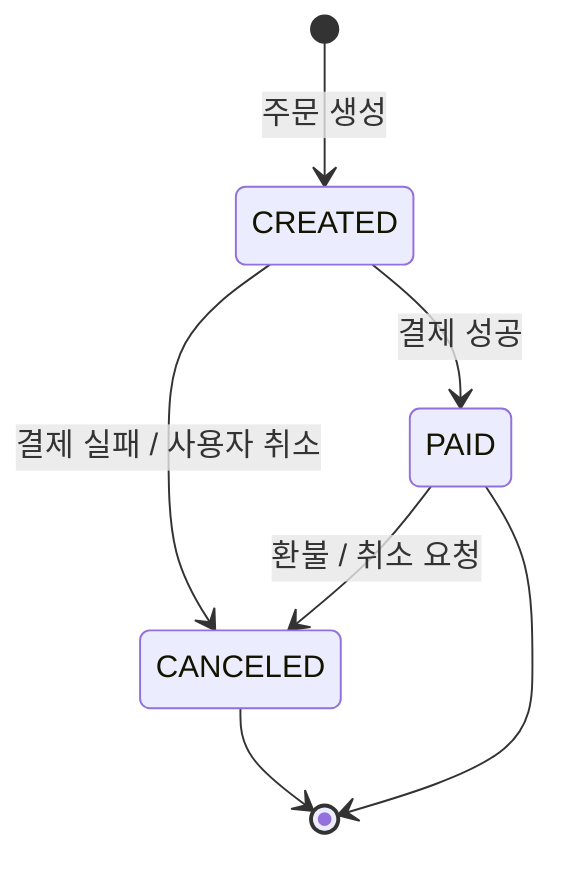
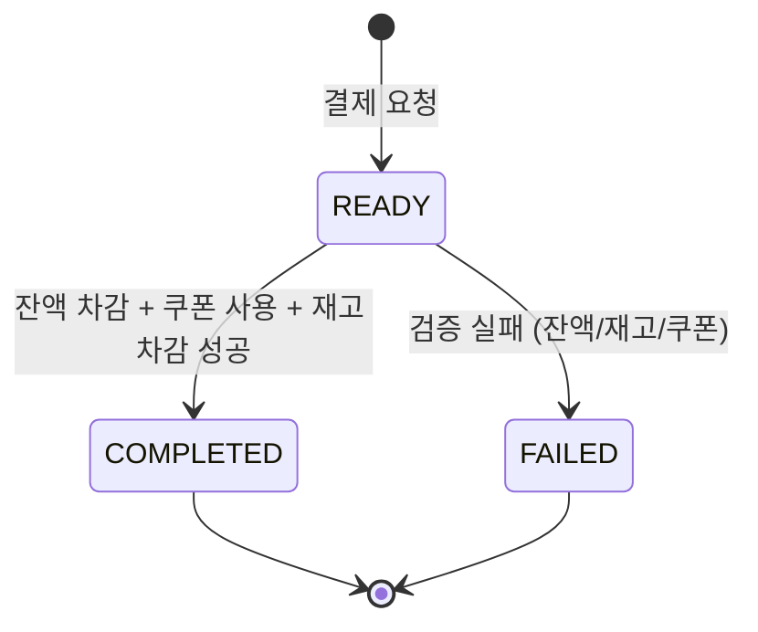
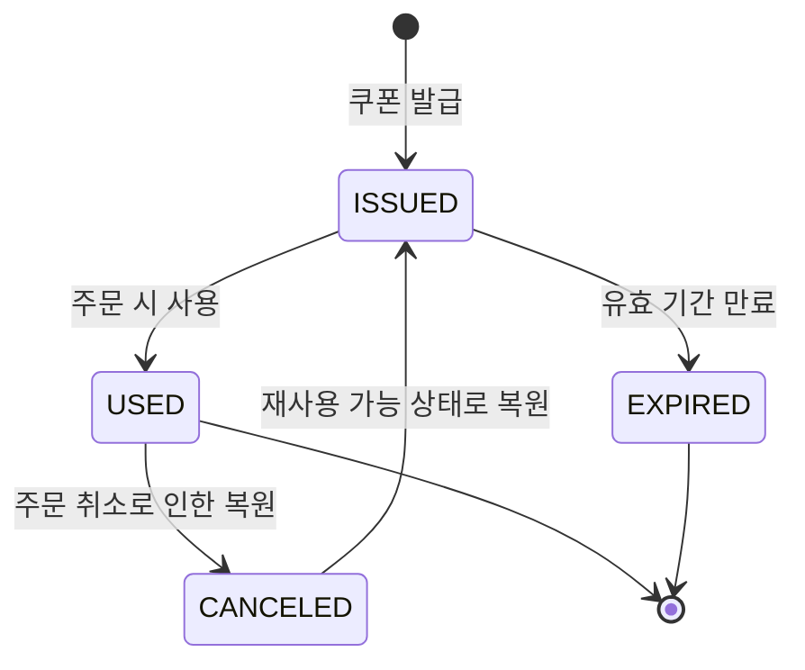

# 상태 다이어그램

이커머스 시스템의 주요 도메인 상태 전이를 정의

---

## 주문 (Order)

주문 생성 이후 결제 완료 또는 취소까지의 상태 전이를 표현

- `CREATED`: 주문 생성됨 (결제 전)
- `PAID`: 결제 완료됨
- `CANCELED`: 주문 취소됨

---

## 결제 (Payment)

결제 요청부터 최종 완료/실패까지의 상태 전이를 표현한다.

- `READY`: 결제 준비 (잔액/쿠폰/재고 검증 전)
- `COMPLETED`: 결제 완료
- `FAILED`: 결제 실패 (잔액 부족, 재고 부족 등)

---

## 쿠폰 (Coupon)

쿠폰 발급 이후 사용 또는 만료까지의 상태 전이를 표현

- `ISSUED`: 쿠폰 발급됨 (사용 가능)
- `USED`: 쿠폰 사용됨
- `EXPIRED`: 쿠폰 만료됨
- `CANCELED`: 쿠폰 사용 취소됨 (주문 취소 시)

