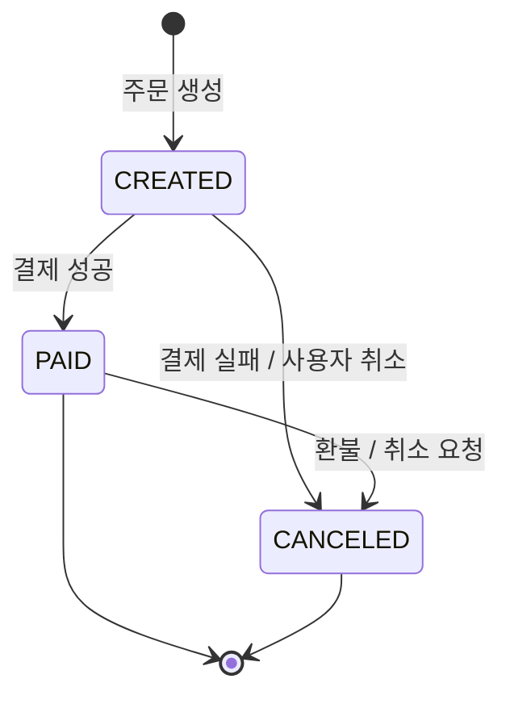
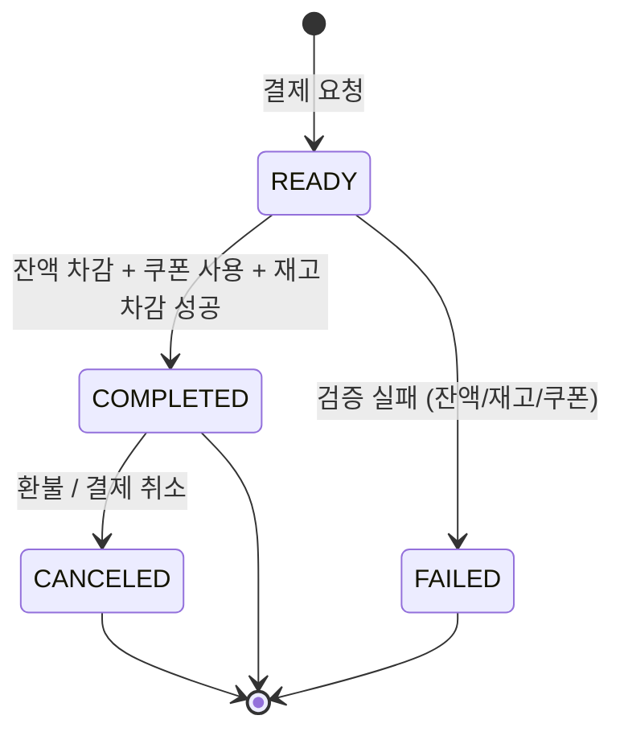
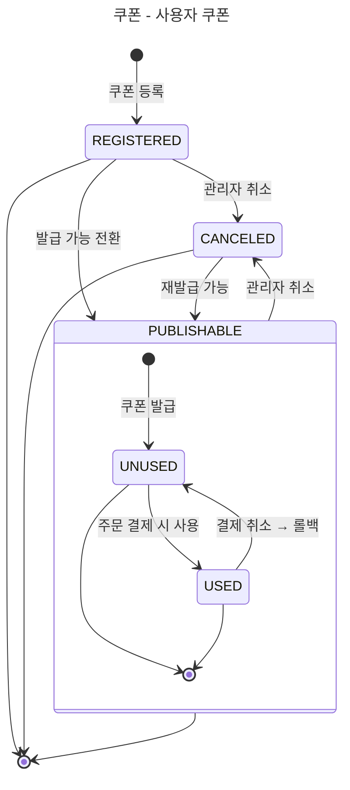
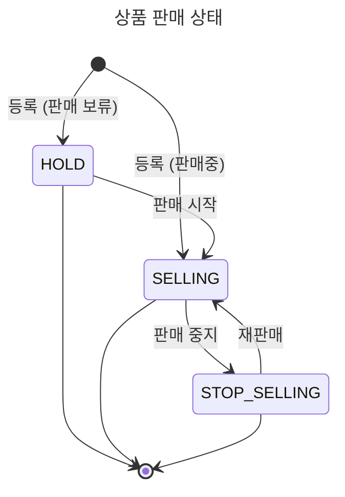

# 상태 다이어그램

이커머스 시스템의 주요 도메인 상태 전이를 정의

---

## 주문 (Order)

주문 생성 이후 결제 완료 또는 취소까지의 상태 전이를 표현

- `CREATED`: 주문 생성됨 (결제 전)
- `PAID`: 결제 완료됨
- `CANCELED`: 주문 취소됨

```mermaid
stateDiagram-v2
    [*] --> CREATED: 주문 생성
    CREATED --> PAID: 결제 성공
    CREATED --> CANCELED: 결제 실패 / 사용자 취소
    PAID --> CANCELED: 환불 / 취소 요청
    PAID --> [*]
    CANCELED --> [*]
```

---

## 결제 (Payment)

결제 요청부터 최종 완료/실패/취소까지의 상태 전이를 표현

- `READY`: 결제 준비 (잔액/쿠폰/재고 검증 전)
- `COMPLETED`: 결제 완료
- `FAILED`: 결제 실패 (잔액 부족, 재고 부족 등)
- `CANCELED`: 결제 취소 (환불 등)

```mermaid
stateDiagram-v2
    [*] --> READY: 결제 요청
    READY --> COMPLETED: 잔액 차감 + 쿠폰 사용 + 재고 차감 성공
    READY --> FAILED: 검증 실패 (잔액/재고/쿠폰)
    COMPLETED --> CANCELED: 환불 / 결제 취소
    COMPLETED --> [*]
    FAILED --> [*]
    CANCELED --> [*]
```

---

## 쿠폰 (Coupon)

쿠폰은 관리자가 관리하는 **쿠폰(`coupon_status`)** 상태와, 사용자가 발급받아 쓰는 **사용자 쿠폰(`used_status`)** 상태로 나뉜다. 사용자 쿠폰의 상태 전이는 쿠폰이 `PUBLISHABLE`(발급 가능)일 때 그 내부에서 일어난다.

**쿠폰 (`coupon_status`)**

- `REGISTERED`: 쿠폰 등록됨 (발급 불가, 노출 차단)
- `PUBLISHABLE`: 발급 가능 상태
- `CANCELED`: 관리자에 의해 취소됨

**사용자 쿠폰 (`used_status`)**

- `UNUSED`: 발급되어 미사용 상태
- `USED`: 주문 결제 시 사용 완료 (결제 취소 시 `UNUSED`로 롤백)

```mermaid
---
title: 쿠폰 - 사용자 쿠폰
---
stateDiagram-v2
    [*] --> REGISTERED: 쿠폰 등록
    REGISTERED --> PUBLISHABLE: 발급 가능 전환
    REGISTERED --> CANCELED: 관리자 취소
    PUBLISHABLE --> CANCELED: 관리자 취소
    CANCELED --> PUBLISHABLE: 재발급 가능
    state PUBLISHABLE {
        [*] --> UNUSED: 쿠폰 발급
        UNUSED --> USED: 주문 결제 시 사용
        USED --> UNUSED: 결제 취소 → 롤백
        UNUSED --> [*]
        USED --> [*]
    }
    REGISTERED --> [*]
    PUBLISHABLE --> [*]
    CANCELED --> [*]
```

> 유효기간(`expired_at`) 초과 시 상태값은 유지되지만 발급/사용이 제한되어 만료로 간주된다.

---

## 상품 (Product)

상품 등록 이후 판매 상태(`sell_status`)의 전이를 표현

- `HOLD`: 판매 보류 (등록되었으나 미노출)
- `SELLING`: 판매 중
- `STOP_SELLING`: 판매 중지

```mermaid
---
title: 상품 판매 상태
---
stateDiagram-v2
    [*] --> HOLD: 등록 (판매 보류)
    [*] --> SELLING: 등록 (판매중)
    HOLD --> SELLING: 판매 시작
    SELLING --> STOP_SELLING: 판매 중지
    STOP_SELLING --> SELLING: 재판매
    HOLD --> [*]
    SELLING --> [*]
    STOP_SELLING --> [*]
```