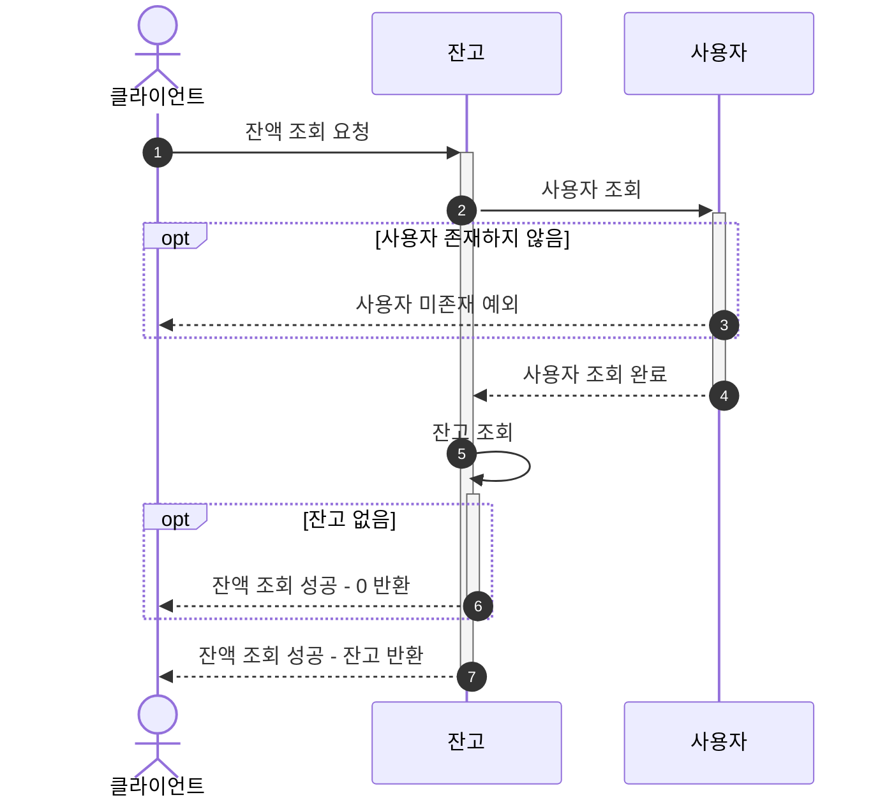
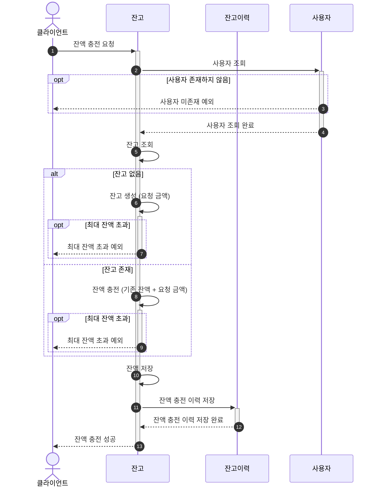
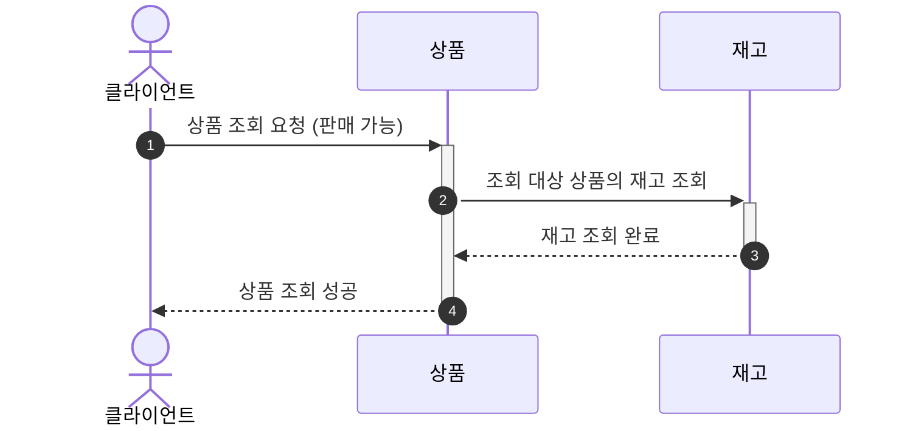
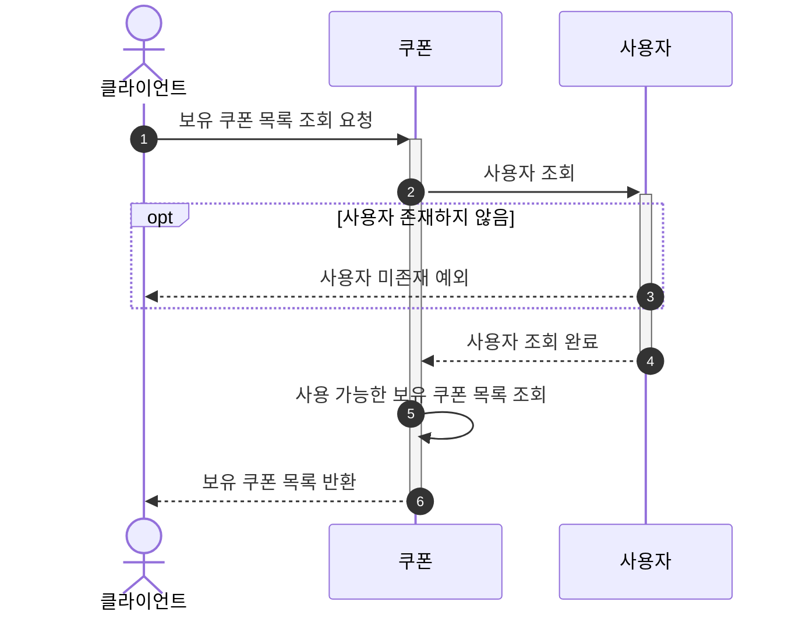
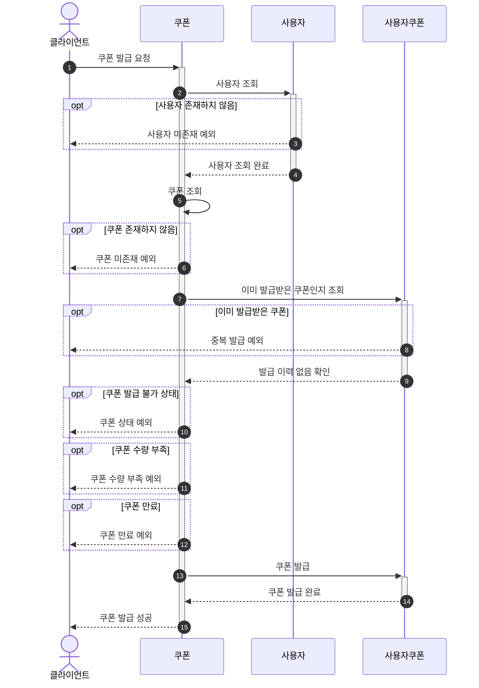

# 시퀀스 다이어그램

## 잔액 (Balance)

### 잔액 조회

**설명**
- (1): 클라이언트가 잔액 조회를 요청한다.
- (2)-(4): 사용자 검증을 진행하며, 검증 실패 시 예외가 발생한다.
- (5)-(7): 잔고를 조회하며, 잔고가 있으면 금액을 반환하고 없으면 0을 반환한다.

---

### 잔액 충전

**설명**
- (1): 클라이언트가 잔액 충전을 요청한다.
- (2)-(4): 사용자 검증을 진행하며, 검증 실패 시 예외가 발생한다.
- (5): 잔고를 조회한다.
- (6)-(9): 잔고가 없으면 새로 생성하고, 있으면 기존 금액에 더한다. 최대 잔액 초과 시 예외가 발생한다.
- (10): 충전한 잔액을 저장한다.
- (11)-(12): 잔액 충전 이력을 저장한다.
- (13): 잔액 충전 성공을 응답한다.

---

## 상품 (Product)

### 상품 조회

**설명**
- (1): 클라이언트가 판매 가능한 상품 목록을 조회한다.
- (2)-(3): 조회 대상 상품의 재고를 조회한다.
- (4): 조회한 상품 목록을 반환한다.

---

## 쿠폰 (Coupon)

### 보유 쿠폰 목록 조회

**설명**
- (1): 클라이언트가 보유 쿠폰 목록 조회를 요청한다.
- (2)-(4): 사용자 검증을 진행하며, 검증 실패 시 예외가 발생한다.
- (5): 사용 가능한 보유 쿠폰 목록을 조회한다.
- (6): 쿠폰 목록을 반환한다.

---

### 선착순 쿠폰 발급

**설명**
- (1): 클라이언트가 쿠폰 발급을 요청한다.
- (2)-(4): 사용자 검증을 진행하며, 검증 실패 시 예외가 발생한다.
- (5)-(6): 쿠폰이 존재하는지 검증한다.
- (7)-(9): 이미 발급받은 쿠폰인지 확인한다.
- (10)-(14): 쿠폰 상태, 수량, 만료일을 검증한다.
- (15)-(16): 쿠폰을 발급한다.

---

## 주문 및 결제 (Order)

### 주문 및 결제 완료

```mermaid
sequenceDiagram
    autonumber
    actor 클라이언트
    participant 주문
    participant 사용자
    participant 상품
    participant 쿠폰
    participant 주문상품
    participant 잔고
    participant 재고
    participant 외부데이터플랫폼

    rect rgb(50, 50, 50)
        Note over 클라이언트, 주문상품: 주문 생성
        클라이언트 ->>+ 주문: 주문/결제 요청
        주문 ->>+ 사용자: 사용자 조회

        opt 사용자 존재하지 않음
            사용자 -->> 클라이언트: 사용자 미존재 예외
        end

        사용자 -->>- 주문: 사용자 조회 완료

        loop 상품 목록 조회
            주문 ->>+ 상품: 상품 조회
            opt 상품 존재하지 않음
                상품 -->> 클라이언트: 상품 미존재 예외
            end
            상품 -->>- 주문: 상품 조회 완료
        end

        opt 쿠폰 ID 존재
            주문 ->>+ 쿠폰: 쿠폰 조회
            opt 쿠폰 사용 불가
                쿠폰 -->> 클라이언트: 쿠폰 사용 불가 예외
            end
            쿠폰 -->>- 주문: 쿠폰 조회 완료
        end

        주문 ->> 주문: 주문 총 금액 계산
        주문 ->> 주문: 주문 생성
        주문 ->>+ 주문상품: 주문 상품 생성
        주문상품 -->>- 주문: 주문 상품 생성 완료
    end

    rect rgb(50, 50, 50)
        Note over 클라이언트, 재고: 결제 완료
        주문 ->>+ 잔고: 잔고 조회
        opt 잔액 부족
            잔고 -->> 클라이언트: 잔액 부족 예외
        end
        잔고 -->>- 주문: 잔고 조회 완료

        주문 ->>+ 잔고: 잔고 차감
        잔고 -->>- 주문: 잔고 차감 완료

        opt 쿠폰 ID 존재
            주문 ->>+ 쿠폰: 쿠폰 사용
            쿠폰 -->>- 주문: 쿠폰 사용 완료
        end

        주문 ->>+ 재고: 재고 조회
        opt 재고 부족
            재고 -->> 클라이언트: 재고 부족 예외
        end
        재고 -->>- 주문: 재고 조회 완료

        주문 ->>+ 재고: 재고 차감
        재고 -->>- 주문: 재고 차감 완료
        주문 ->> 주문: 결제 완료 처리
    end

    주문 ->> 외부데이터플랫폼: 주문 정보 전송
    주문 -->>- 클라이언트: 주문/결제 성공 응답
```

**설명**

**(1)-(14): 주문 생성**
- (1): 클라이언트가 주문/결제를 요청한다.
- (2)-(4): 사용자 검증을 진행한다.
- (5)-(7): 상품 목록을 검증한다.
- (8)-(10): 쿠폰이 존재하면 검증한다.
- (11)-(14): 주문 총 금액을 계산하고 주문 및 주문 상품을 생성한다.

**(15)-(26): 결제 완료**
- (15)-(18): 잔고를 조회하고 차감한다.
- (19)-(20): 쿠폰이 있으면 사용한다.
- (21)-(25): 재고를 검증하고 차감한다.
- (26): 결제 완료 처리한다.
- (27): 외부 데이터 플랫폼으로 주문 정보를 전송한다.

---

## 인기 상품 (ProductRank)

### 인기 상품 배치 및 조회

```mermaid
sequenceDiagram
    autonumber
    actor 클라이언트
    participant 스케줄러
    participant 주문상품
    participant 상품통계

    rect rgb(50, 50, 50)
        Note over 스케줄러, 상품통계: 인기 상품 통계 배치
        loop 배치 폴링
            스케줄러 -->>+ 스케줄러: 배치 시간 확인
            opt 배치 시간
                스케줄러 ->>+ 주문상품: 배치 시작
                주문상품 ->> 주문상품: 최근 3일 주문 완료 상품 집계
                주문상품 ->>+ 상품통계: 집계 데이터 저장
                상품통계 -->>- 주문상품: 집계 데이터 저장 완료
                주문상품 -->>- 스케줄러: 배치 완료
            end
        end
    end

    클라이언트 ->>+ 상품통계: 인기 상품 Top5 조회 요청
    상품통계 -->>- 클라이언트: 인기 상품 Top5 응답
```

**설명**

**(1)-(6): 통계 배치**
- (1): 스케줄러가 배치 시간을 확인한다.
- (2)-(5): 배치 시간이 되면 최근 3일 주문 완료 상품을 집계하여 저장한다.

**(7)-(8): 인기 상품 조회**
- (7): 클라이언트가 인기 상품 Top5를 요청한다.
- (8): 사전 집계된 데이터를 반환한다.