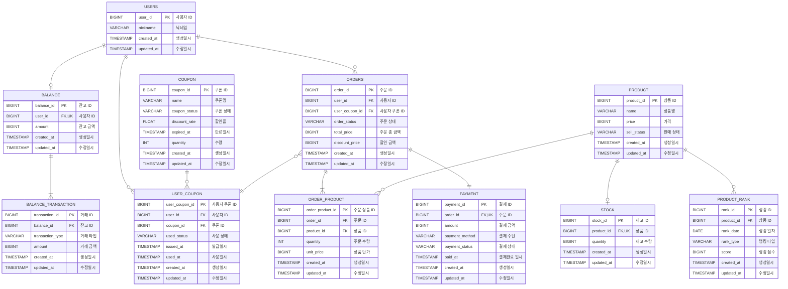

# ERD

## 설계 의도

- `BALANCE`, `STOCK`은 `USERS`, `PRODUCT`와 1:1 관계지만, 도메인 독립성을 위해 별도 PK를 사용
- `BALANCE.amount`, `COUPON.quantity`, `STOCK.quantity`는 동시성 제어가 필요한 컬럼 (STEP05에서 처리 예정)
- `COUPON.coupon_status`, `PRODUCT.sell_status`는 등록 즉시 노출을 막기 위한 관리자 성격의 상태 컬럼

---

## ERD

---

## 상태 및 타입 정의

### transaction_type (BALANCE_TRANSACTION)

| Type | Description |
|---|---|
| CHARGE | 충전 |
| USE | 차감 |

### coupon_status (COUPON)

| Type | Description |
|---|---|
| REGISTERED | 등록 (발급 불가) |
| PUBLISHABLE | 발급 가능 |
| CANCELED | 취소 |

### used_status (USER_COUPON)

| Type | Description |
|---|---|
| UNUSED | 미사용 |
| USED | 사용 완료 |

### sell_status (PRODUCT)

| Type | Description |
|---|---|
| HOLD | 판매 보류 |
| SELLING | 판매 중 |
| STOP_SELLING | 판매 중지 |

### rank_type (PRODUCT_RANK)

| Type | Description |
|---|---|
| SELL | 판매량 기준 |

### order_status (ORDERS)

| Type | Description |
|---|---|
| CREATED | 주문 생성 |
| PAID | 결제 완료 |
| CANCELED | 주문 취소 |

### payment_status (PAYMENT)

| Type | Description |
|---|---|
| READY | 결제 준비 |
| COMPLETED | 결제 완료 |
| FAILED | 결제 실패 |
| CANCELED | 결제 취소 |

### payment_method (PAYMENT)

| Type | Description |
|---|---|
| BALANCE | 잔액 결제 |
| KAKAO_PAY | 카카오페이 |
| TOSS_PAY | 토스페이 |
| NAVER_PAY | 네이버페이 |
