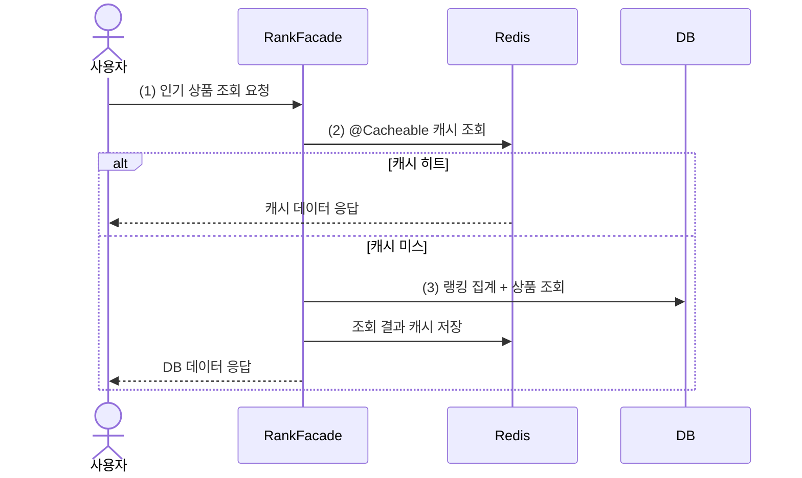
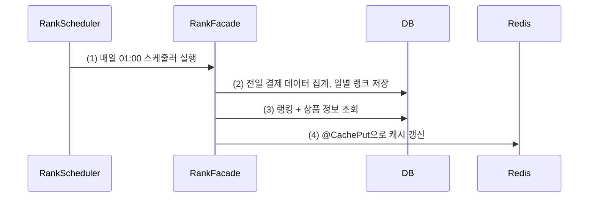

# 캐시 전략 설계

## 배경

조회 시간이 오래 걸리거나, 요청 빈도가 높거나, 자주 변하지 않는 데이터에 캐시를 적용하면 적은 비용으로 성능을 개선할 수 있다.

이번 단계에서는 전체 조회 기능 중 캐시가 효과적으로 작동할 수 있는 대상을 선별하고, TTL과 갱신 주기를 어떻게 가져갈지 정한다.
다만 캐시가 만능은 아니다. 정합성이 중요한 기능은 성능보다 정확성이 우선이므로, 모든 조회에 일괄 적용하지 않고 기능 특성을 보고 판단한다.

## 캐싱 대상 선정

### 인기 상품 조회

인기 상품 조회를 캐싱 대상으로 골랐다. 이유는 두 가지다.

- 요청 빈도가 높다. 메인 화면성 API라 트래픽이 몰린다.
- 데이터가 하루에 한 번만 바뀐다. 일별 판매 랭크는 새벽 배치로 집계되고, 그 후로는 하루 종일 같은 값을 반환한다.

조회는 많은데 변경은 하루 한 번이니, 캐시 적중률을 높게 유지하기 좋은 조건이다.

이번에 인기 상품 조회를 Product 도메인에서 Rank 도메인으로 옮겼다.
인기 상품의 본질이 판매 랭킹 집계라서 Rank가 책임을 갖는 게 맞다고 봤고,
이 과정에서 product와 rank 사이에 있던 양방향 의존도 product → rank 단방향으로 정리됐다.

> 기능이 확장되면 상품 상세 조회 같은 곳에도 캐시를 검토할 수 있다.

## 캐싱 전략 - 인기 상품 조회

### 캐시 읽기 전략

읽기는 Read Through 방식이다. 항상 Redis를 먼저 조회하고, 미스가 나면 DB에서 조회한 결과를 캐시에 저장한다.



```java
@Cacheable(cacheNames = CacheType.CacheName.POPULAR_PRODUCT,
        key = "'top:' + #criteria.top + ':days:' + #criteria.days")
@Transactional(readOnly = true)
public RankResult.PopularProducts getPopularProducts(RankCriteria.PopularProducts criteria) {
    return findPopularProducts(criteria.getTop(), criteria.getDays()); // 캐시 미스 시 DB 조회 후 캐시 저장
}
```

주의할 점은, 아래 쓰기 전략대로라면 캐시는 배치가 미리 채워두기 때문에 (3)의 캐시 미스는 정상 흐름이 아니라는 것이다.
배치가 연속으로 실패했거나 TTL이 만료된 예외 상황이고, 이때 트래픽이 많으면 미스 요청이 한꺼번에 DB로 몰리는
캐시 스탬피드(Cache Stampede)가 생길 수 있다.

### 캐시 쓰기 전략

쓰기는 배치 기반이다. 매일 01:00에 스케줄러가 일별 랭크를 DB에 저장하면서 캐시도 같이 갱신한다.
사용자 요청이 캐시를 채우는 게 아니라 배치가 미리 채워두는 구조라, 사용자 입장에서는 거의 항상 캐시 히트다.



```java
@CachePut(cacheNames = CacheType.CacheName.POPULAR_PRODUCT,
        key = "'top:' + #criteria.top + ':days:' + #criteria.days")
@Transactional(readOnly = true)
public RankResult.PopularProducts updatePopularProducts(RankCriteria.PopularProducts criteria) {
    return findPopularProducts(criteria.getTop(), criteria.getDays()); // 캐시 갱신용 조회
}
```

```java
@Scheduled(cron = "0 0 1 * * *")
public void createDailyRank() {
    rankFacade.createDailyRankAt(yesterday);
    rankFacade.updatePopularProducts(RankCriteria.PopularProducts.ofTop5Days3()); // 캐시 선갱신
}
```

캐시 키는 `popular-product::top:5:days:3` 형태로 조건을 키에 포함시켰다. 나중에 top/days 조합이 늘어나도 키가 충돌하지 않는다.

### 캐시 TTL 전략

TTL은 49시간으로 잡았다.

- 24시간으로 하면 매일 01:00 배치와 만료 시점이 겹쳐서, 갱신 직전에 캐시가 먼저 죽는 타이밍 이슈가 생길 수 있다.
- 배치가 하루 실패해도 전날 캐시가 살아있고, 그 사이에 수동으로 갱신할 여유가 있도록 이틀 + 1시간으로 정했다.
- 어차피 배치가 매일 덮어쓰므로 별도 eviction 정책은 두지 않았다.

```java
POPULAR_PRODUCT("인기 상품 캐싱") {
    @Override
    public Duration ttl() {
        return Duration.ofHours(49);
    }
}
```

> 참고: 00:00 ~ 01:00 사이에는 아직 전날 랭크가 반영되기 전이라, "최근 3일"이 아니라 하루 밀린 데이터가 조회된다.
> 인기 상품 특성상 이 정도 지연은 허용 가능하다고 판단하고 수용했다.

## 트러블슈팅: 캐시 쓰기가 비동기라서 테스트가 깨진 문제

캐시 검증 테스트가 간헐적으로 실패했다. 어떤 날은 통과하고 어떤 날은 다른 테스트가 깨지는 식이라 원인을 잡기 어려웠는데,
Redis MONITOR로 명령 순서를 찍어보니 테스트의 검증용 GET이 @Cacheable의 SET보다 먼저 도착하고 있었다.

```
85.882578  GET popular-product::top:5:days:3   <- 메서드 리턴 직후 조회 (미스)
85.882796  SET popular-product::top:5:days:3   <- 캐시 저장이 0.2ms 늦게 도착
```

원인은 Spring Data Redis 4부터 RedisCacheWriter의 쓰기가 기본 비동기(fire-and-forget)로 바뀐 것이었다.
메서드가 리턴돼도 캐시 쓰기가 아직 Redis에 반영되지 않았을 수 있다.

우리 구조는 배치가 캐시를 갱신한 직후 조회가 들어오는 흐름이라 쓰기 직후 조회 일관성이 필요했고,
`immediateWrites()` 옵션으로 동기 쓰기로 되돌려 해결했다.

```java
RedisCacheWriter cacheWriter = RedisCacheWriter.create(
        redisConnectionFactory, configurer -> configurer.immediateWrites());

return RedisCacheManager.builder(cacheWriter)
        .cacheDefaults(defaultConfig)
        .withInitialCacheConfigurations(configs)
        .build();
```

캐시 쓰기가 하루 한 번 배치에서만 일어나는 지금 구조에서는 동기 쓰기의 비용이 사실상 없다.

## 테스트를 통한 캐싱 검증

테스트 간 캐시 간섭을 막기 위해 캐시 키만 골라 지우는 RedisCacheCleaner를 만들었다.
flushDb를 쓰지 않은 건 분산 락 등 다른 Redis 데이터까지 지워지는 걸 피하기 위해서다.

캐시는 DB와 달리 테스트 트랜잭션이 롤백돼도 남는다. 실제로 통합 테스트가 캐시에 남긴 값이
뒤에 실행되는 E2E 테스트를 깨뜨리는 일이 있어서, setUp과 tearDown 양쪽에서 클렌징하도록 했다.

```java
@BeforeEach
void setUp() {
    redisCacheCleaner.clean(); // 이전 실행 잔존 캐시 방어
}

@AfterEach
void tearDown() {
    redisCacheCleaner.clean();
}
```

검증은 세 가지 케이스로 했다. 캐시에 실제로 저장됐는지는 RedisCacheTemplate으로 Redis를 직접 읽어 확인한다.

첫 번째, 캐시 미스 시 조회 결과가 캐시에 저장되는지.

```java
@DisplayName("인기 상품을 조회하면 결과가 캐시에 저장된다.")
@Test
void getPopularProducts() {
    Optional<RankResult.PopularProducts> empty =
            redisCacheTemplate.get(CacheType.POPULAR_PRODUCT, CACHE_KEY, RankResult.PopularProducts.class);

    rankFacade.getPopularProducts(RankCriteria.PopularProducts.ofTop5Days3());

    assertThat(empty).isEmpty();
    RankResult.PopularProducts cached = redisCacheTemplate
            .get(CacheType.POPULAR_PRODUCT, CACHE_KEY, RankResult.PopularProducts.class).orElseThrow();
    assertThat(cached.getProducts())
            .extracting("productId")
            .containsExactly(product3.getId(), product2.getId(), product1.getId());
}
```

두 번째, @CachePut이 캐시를 저장하는지.

```java
@DisplayName("인기 상품을 @CachePut으로 캐시에 갱신한다.")
@Test
void updatePopularProductsForCache() {
    Optional<RankResult.PopularProducts> empty =
            redisCacheTemplate.get(CacheType.POPULAR_PRODUCT, CACHE_KEY, RankResult.PopularProducts.class);

    rankFacade.updatePopularProducts(RankCriteria.PopularProducts.ofTop5Days3());

    assertThat(empty).isEmpty();
    RankResult.PopularProducts cached = redisCacheTemplate
            .get(CacheType.POPULAR_PRODUCT, CACHE_KEY, RankResult.PopularProducts.class).orElseThrow();
    assertThat(cached.getProducts())
            .extracting("productId")
            .containsExactly(product3.getId(), product2.getId(), product1.getId());
}
```

세 번째, 기존 캐시가 있어도 갱신하면 덮어써지는지.

```java
@DisplayName("기존 캐시가 있어도 갱신하면 최신 내용으로 덮어쓴다.")
@Test
void updatePopularProductsForRefresh() {
    redisCacheTemplate.put(CacheType.POPULAR_PRODUCT, CACHE_KEY, "stale");
    Optional<String> stale = redisCacheTemplate.get(CacheType.POPULAR_PRODUCT, CACHE_KEY, String.class);

    rankFacade.updatePopularProducts(RankCriteria.PopularProducts.ofTop5Days3());

    assertThat(stale).contains("stale");
    RankResult.PopularProducts cached = redisCacheTemplate
            .get(CacheType.POPULAR_PRODUCT, CACHE_KEY, RankResult.PopularProducts.class).orElseThrow();
    assertThat(cached.getProducts())
            .extracting("productId")
            .containsExactly(product3.getId(), product2.getId(), product1.getId());
}
```

세 케이스 모두 통과했고, 컨트롤러 단위/E2E/REST Docs 테스트도 함께 통과했다.

## 캐시 성능 비교

캐시 적용 전후의 차이를 K6 부하 테스트로 측정했다.
상품 10,000건, 판매 랭크 30,000행(3일치)을 넣은 상태에서 진행했다.

> 로컬 환경에서 K6 기본 요약 지표로 측정한 결과다. Grafana 시각화를 포함한 정밀 측정은 부하 테스트 단계에서 다시 한다.

### 테스트 케이스

- CASE 1: @Cacheable을 주석 처리하고 매 요청마다 DB 집계 쿼리 실행
- CASE 2: @Cacheable 활성화 + 캐시 워밍업 후 Redis 조회

### 테스트 시나리오

가상 사용자가 인기 상품 조회 API를 반복 호출한다. 총 70초 동안 부하를 단계적으로 올렸다 내린다.

- 0~10초: 0 → 25명
- 10~20초: 25 → 50명
- 20~30초: 50 → 100명
- 30~40초: 100명 유지
- 40~50초: 100 → 50명
- 50~60초: 50 → 25명
- 60~70초: 25 → 0명

### 테스트 결과

CASE 1 (DB 조회): 3,510건 처리 (49.53 RPS), 평균 12.65ms, 중앙값 11.51ms, p95 19.67ms, 최대 797.25ms, 오류 0%

CASE 2 (캐시 조회): 3,540건 처리 (50.33 RPS), 평균 3.60ms, 중앙값 3.27ms, p95 6.53ms, 최대 37.30ms, 오류 0%

| 구분        | DB 조회     | 캐시 조회    | 개선    |
|-----------|-----------|----------|-------|
| 평균        | 12.65 ms  | 3.60 ms  | 3.5배  |
| 중앙값       | 11.51 ms  | 3.27 ms  | 3.5배  |
| 최소        | 5.51 ms   | 1.11 ms  | 5.0배  |
| 최대        | 797.25 ms | 37.30 ms | 21.4배 |
| p90       | 17.49 ms  | 5.21 ms  | 3.4배  |
| p95       | 19.67 ms  | 6.53 ms  | 3.0배  |

처리량(RPS)은 49.53 → 50.33으로 큰 차이가 없는데, 시나리오가 요청 사이에 1초씩 쉬기 때문에 VU 수가 처리량 상한을 정해서 그렇다.

눈에 띄는 건 최대 응답 시간이다. DB 조회는 VU 100 구간에서 최대 797ms까지 튀었는데,
집계 쿼리가 커넥션 풀과 DB 자원을 놓고 경합하면서 생긴 지연이다. 캐시를 쓰면 이 경합 자체가 사라져서 최대가 37ms에 그친다.
평균 3.5배 개선보다 이 꼬리 지연 21배 개선이 실제 체감에는 더 크게 작용한다.

지금은 랭크 3만 행 기준이라 DB 집계도 빠른 편인데, 데이터가 쌓일수록 DB 조회 비용은 늘고 캐시 응답 비용은 그대로이므로 격차는 더 벌어진다.

## 한계

### @Cacheable의 장애 대응 한계

@Cacheable은 Redis 장애 시 DB로 우회(fallback)하는 기능이 없다. Redis가 죽으면 조회 자체가 실패한다.
resilience4j 같은 라이브러리로 Circuit Breaker를 적용하면 Redis 접근 실패 시 DB로 우회하거나 빠르게 실패 처리할 수 있다.
분산 락용 Redis와 캐시용 Redis를 물리적으로 분리하는 것도 장애 반경을 줄이는 방법이다.

### Redis 병목 가능성

트래픽이 늘면 Redis 네트워크 I/O 자체가 병목이 될 수 있다.
Caffeine 같은 로컬 캐시를 Redis 앞단에 두는 멀티 캐시 레이어로 부하를 분산하는 방안을 추후 검토할 수 있다.

### 즉시 쓰기의 트레이드오프

immediateWrites는 일관성을 얻는 대신 쓰기 시점에 호출 스레드가 Redis 응답을 기다린다.
지금은 캐시 쓰기가 하루 1회 배치뿐이라 영향이 없지만, 쓰기가 잦은 캐시를 추가하게 되면 다시 따져봐야 한다.

## 결론

인기 상품 조회에 Read Through + 배치 선갱신 조합의 캐싱을 적용했다.
TTL 49시간과 배치 워밍업으로 사용자 요청이 캐시 미스를 만나는 구간을 거의 없앴고,
K6 측정에서 평균 응답 3.5배, 최대 응답 21배 개선을 확인했다.

과정에서 Spring Data Redis 4의 비동기 쓰기 기본값 변경 때문에 테스트가 간헐적으로 깨지는 문제를 겪었고,
MONITOR로 레이스를 실측해서 immediateWrites로 해결했다. 프레임워크 메이저 버전을 올려 쓸 때는
이런 기본 동작 변경을 의심 목록에 올려둬야 한다는 걸 배웠다.

남은 과제는 Redis 장애 시 fallback과, 데이터 규모가 커졌을 때의 재측정이다. 각각 이후 단계에서 다룬다.
