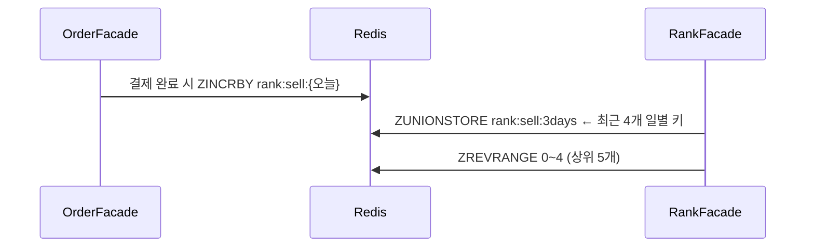
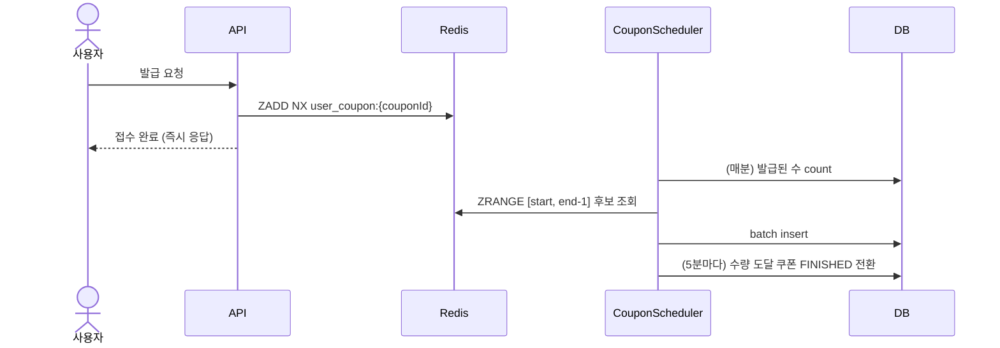

# Redis 디자인 아키텍처

## 배경

이번 단계에서는 DB에 몰려 있던 두 기능을 Redis 자료구조 기반으로 옮겼다.

- 인기 상품 랭킹: 하루 한 번 배치로 DB에 집계하던 것을, 결제 시점에 실시간으로 쌓는 구조로
- 선착순 쿠폰 발급: 비관적 락 + 분산 락으로 지키던 것을, Redis 원자 연산으로 락 없이 처리하는 구조로

두 기능 모두 "동시에 많은 요청이 같은 데이터를 두드리는" 지점이라 DB로 버티기엔 비용이 컸고,
Redis의 ZSET이 정렬·중복 제거·원자 연산을 자료구조 차원에서 제공하기 때문에 설계 자체를 단순하게 만들 수 있었다.

## 대상 선정 이유

### 인기 상품 조회

기존 구조는 매일 새벽 배치가 전일 결제 데이터를 집계해 DB 랭크 테이블에 저장하고, 조회는 그 테이블을 GROUP BY로 합산하는 방식이었다.
문제는 두 가지였다. 오늘 팔린 상품이 내일 새벽까지 랭킹에 반영되지 않고, 배치가 실패하면 그날 랭킹이 통째로 빈다.

판매량 집계는 "상품별 점수 누적 + 상위 N개 정렬"이라는 ZSET의 전형적인 사용처라, 실시간 전환의 구현 비용도 낮았다.

### 선착순 쿠폰 발급

기존 구조는 발급 요청마다 쿠폰 행을 비관적 락으로 잡고 수량을 차감했다. 분산 락까지 겹쳐 있어 요청이 몰리면 락 대기가 그대로 응답 지연이 된다.
선착순 발급의 본질은 "중복 없이, 순서대로, 수량만큼"인데, 이 세 가지가 전부 ZSET 연산 하나로 해결된다.
요청 시각을 score로 하는 `ZADD NX`는 중복 방지와 순서 보존을 원자적으로 처리하고, 수량 제한은 발급 시점에 범위 조회로 자른다.

## 설계

Redis 키는 공통 인터페이스(`KeyGeneratable` + `KeyType`)로 규격화했다. `타입:네임스페이스` 형태로 조립되며,
테스트 클렌징도 이 타입 프리픽스 단위로 동작한다.

```
rank:sell:20260707      (일별 판매 랭킹 ZSET)
rank:sell:3days         (최근 3일 합산 결과 ZSET)
user_coupon:5           (쿠폰 5번의 발급 요청 ZSET)
```

### 인기 상품 조회

#### 주문 결제 완료 시, 판매량 집계

주문 결제가 완료되면 트랜잭션 마지막에 주문 상품 수량만큼 당일 키에 점수를 올린다.

```java
// OrderFacade.createOrder 마지막
rankService.createSellRank(criteria.toRankCommand(LocalDate.now()));

// RankRedisRepository
redisTemplate.opsForZSet().incrementScore(key, rank.getProductId(), rank.getScore());
```

조회는 기준일 포함 최근 N+1일치 일별 키를 `ZUNIONSTORE`로 합산 키에 만들고, 상위 N개를 역순 조회한다.



#### 실시간 인기상품 스케줄러

- 5분마다: 합산 결과를 `@CachePut`으로 인기 상품 캐시에 갱신한다. 일 단위였던 랭킹 신선도가 5분 단위가 된다.
- 매일 00:00:10: 40일이 지난 일별 키를 통째로 읽어 DB에 batch insert하고 키를 삭제한다.
  일별 키에 TTL을 걸지 않는 대신 이 스케줄러가 Redis 메모리 누적을 막고, 과거 데이터는 DB에 보존된다.

### 선착순 쿠폰 발급

발급을 "요청 접수"와 "실제 발급"으로 분리했다. API는 접수만 하고 즉시 응답하며, 발급은 스케줄러가 배치로 처리한다.

#### 발급 요청 - Redis 저장

```java
// 요청 시각을 score로, ZADD NX
redisTemplate.opsForZSet().addIfAbsent(key, command.getUserId(), score);
```

같은 사용자가 몇 번을 눌러도 첫 요청만 남는다. 락 없이도 중복 방지와 선착순 순서가 보장되는 이유가 이 한 줄이다.
접수 실패(중복)면 즉시 예외로 응답한다.

#### 실제 발급 - DB 저장

매분 스케줄러가 발급 가능 상태의 쿠폰들을 순회하며:

1. `start` = 이미 발급된 수(DB count), `end` = min(총수량, start + 회당 최대 100건)
2. 요청 ZSET에서 `[start, end-1]` 범위의 후보를 순서대로 조회
3. `UserCoupon`으로 변환해 JDBC batch insert

수량 초과분은 range에서 잘려나가므로, 동시에 수만 명이 요청해도 발급은 정확히 수량만큼이다.
쿠폰 수량 차감이나 행 잠금이 아예 없다.

#### 발급 종료

5분마다(발급 스케줄과 30초 어긋나게) 발급 수가 수량에 도달한 쿠폰을 `FINISHED`로 전환한다.
발급 종료된 쿠폰은 발급 불가 상태 목록에도 포함시켜, 어떤 경로로도 추가 발급이 차단되도록 했다.



## 테스트

### 인기 상품 조회

- 여러 날짜에 걸친 점수를 넣고 union 합산 결과의 순서와 범위(기준일 포함 N+1일, 범위 밖 제외)를 검증
- 주문 결제 완료 시 랭킹에 실시간 반영되는지 주문 통합 테스트에서 함께 검증
- 40일 영속: Redis에 넣은 랭크가 DB로 이동하고 원본 키가 삭제되는지 검증

### 선착순 쿠폰 발급

- 같은 사용자가 동시에 10번 요청 → 1건만 접수 (ZADD NX 검증)
- 수량 10개에 30명이 동시 요청 → 배치 발급 후 정확히 10건만 DB에 존재
- 수량 도달 시 FINISHED 전환 검증

기존의 비관적 락·분산 락 기반 동시성 테스트는 락이 사라졌으므로 삭제하고, 위 Redis 기반 테스트로 교체했다.

ZSET은 DB 트랜잭션과 달리 테스트 롤백의 영향을 받지 않으므로, 키 타입 프리픽스 단위로 지우는
`RedisKeyCleaner`를 만들어 통합 테스트 앞뒤에서 정리한다. 캐시 정리(`RedisCacheCleaner`)와 역할을 분리해
서로의 키를 건드리지 않는다.

## 한계

### 트랜잭션과 Redis 쓰기의 원자성

판매량 집계는 주문 트랜잭션 안에서 Redis에 쓴다. 커밋 직전 실패하면 DB는 롤백되지만 ZSET 점수는 남는다.
반대로 Redis 장애 시에는 예외가 전파되어 주문 전체가 실패한다 — 부가 기능인 랭킹이 주문 가용성을 물고 들어가는 구조다.
다음 단계(이벤트 기반 아키텍처)에서 결제 완료 이벤트로 분리해 해소할 예정이다.

### 발급 요청의 검증 부재

접수 API는 유저·쿠폰 존재를 검증하지 않고 ZSET에 기록한다. 접수를 가볍게 유지하기 위한 선택이지만,
유효하지 않은 요청도 자리를 차지할 수 있다. 발급 시점에 걸러지므로 정합성 문제는 없으나,
악의적 요청이 많다면 접수 단계 검증이나 rate limit을 고려해야 한다.

### 스케줄러의 단일 인스턴스 가정

발급·마감·영속 스케줄러 모두 단일 인스턴스 기준이다. 서버가 여러 대가 되면 같은 배치가 중복 실행될 수 있어,
분산 환경에서는 스케줄러 락(ShedLock 등)이나 리더 선출이 필요하다.

## 결론

인기 상품은 배치 집계에서 실시간 ZSET 집계로, 선착순 쿠폰은 락 기반 동기 발급에서 Redis 접수 + 배치 발급으로 전환했다.
결과적으로 두 기능 모두에서 락이 사라졌고, 동시성 제어의 책임이 애플리케이션 코드에서 자료구조의 원자 연산으로 내려갔다.

락으로 지키던 것을 자료구조 선택으로 대체할 수 있다는 것이 이번 단계에서 배운 가장 큰 교훈이다.
경합 지점을 만났을 때 "어떻게 잠글까"보다 "경합이 없는 구조로 바꿀 수 없나"를 먼저 물어야 한다.

남은 숙제는 트랜잭션-Redis 원자성(이벤트 분리)과 대량 트래픽에서의 실측 검증(부하 테스트 단계)이다.
