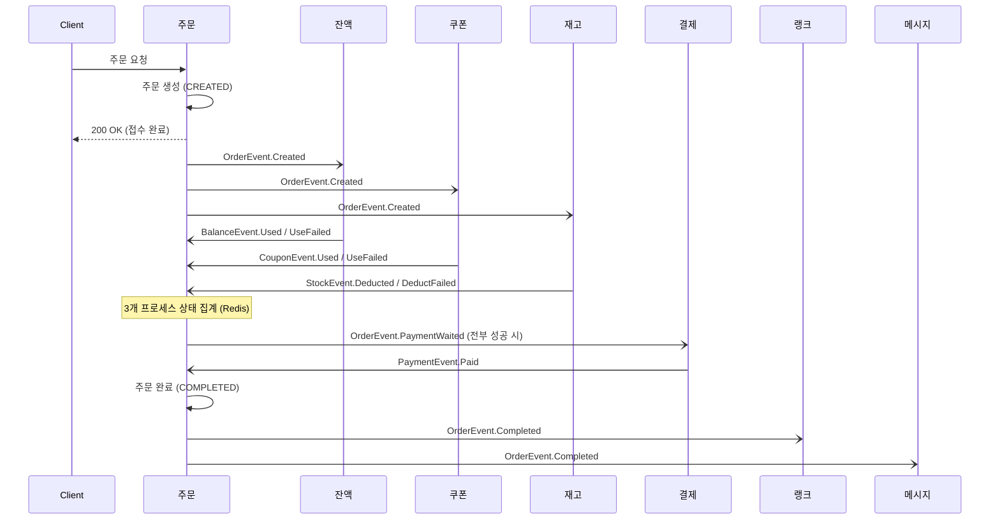

# 이벤트 기반 아키텍처 설계 보고서 (MSA 전환 관점)

## 배경

서비스 규모가 커지면 모놀리식 아키텍처는 유지보수·확장성·배포 측면에서 한계를 드러낸다. 하나의 배포 단위 안에서 모든 도메인이 강하게 결합되어 있어, 일부 기능의 변경이 전체 배포로 이어지고 특정 도메인의 부하가 시스템 전체로 전파된다.

이 문제를 완화하고 서비스 간 결합도를 낮추기 위한 방향으로 MSA(Microservices Architecture)가 고려된다. MSA는 개발·배포·운영의 독립성과 확장성을 제공하지만, 모든 상황에 적합한 구조는 아니다. 도입 시 시스템 구조가 복잡해지고 장애 대응, 데이터 정합성, 인프라 운영 부담이 증가한다.

따라서 서비스의 규모와 복잡도를 충분히 고려해 상황에 맞는 아키텍처를 선택해야 하며, 경우에 따라 모놀리식이 더 적절할 수 있다. 본 보고서는 현재 모놀리식으로 구현된 주문/결제 흐름을 MSA 전환을 염두에 둔 이벤트 기반 구조로 리팩터링한 설계를 정리한다. 실제 물리적 서비스 분리 이전 단계로, 도메인 간 협력을 Spring ApplicationEvent 기반의 비동기 이벤트로 전환하여 결합을 끊는 것을 목표로 한다.

## 도메인 분리 및 배포 단위 설정

도메인 분리는 서비스 간 결합도를 최소화하고 각 서비스가 독립적으로 개발·배포·운영될 수 있도록 하는 데 목적이 있다. 분리 기준은 다음과 같다.

- 루트 애그리거트(Root Aggregate) 간의 명확한 책임 경계
- 도메인 객체 간 응집도·결합도 수준
- 객체의 생명주기(Lifecycle) 일치 여부
- Bounded Context 기준의 모델 일관성

### 모놀리식 시스템 (AS-IS)

현재 하나의 애플리케이션 안에 다음 엔티티가 함께 존재한다.

- 사용자: `User`
- 잔액: `Balance`
- 쿠폰 / 사용자 쿠폰: `Coupon`, `UserCoupon`
- 상품 / 재고: `Product`, `Stock`
- 랭크: `Rank`
- 주문 / 주문 상품: `Order`, `OrderProduct`
- 결제: `Payment`

### MSA 시스템 (TO-BE)

Bounded Context를 기준으로 다음 서비스 단위로 분리하는 것을 목표로 한다.

- 사용자 서비스: `User`
- 잔액 서비스: `Balance`
- 쿠폰 서비스: `Coupon`, `UserCoupon`
- 주문 서비스: `Order`, `OrderProduct`
- 결제 서비스: `Payment`
- 상품 서비스: `Product`, `Stock`, `Rank`

> 본 단계에서는 물리적 분리 전, 위 경계를 코드 구조(feature 패키지)와 이벤트 계약으로 먼저 확립한다. 실제 모듈/서비스 분리는 이후 단계에서 진행한다.

## 이벤트 기반 아키텍처

서비스 간 통신을 REST API 동기 호출로 구성하면 결합도가 높아지고 장애 전파·확장성 측면에서 제약이 생긴다. 반면 이벤트 기반 아키텍처는 비동기 메시지 통신으로 서비스 간 느슨한 결합을 유지하고, 처리를 병렬로 분산시켜 성능·확장성 측면에서 유리하다.

이벤트 기반 구조 도입의 핵심은 두 가지다.

1. 비즈니스 이벤트의 명확한 정의
2. 이벤트 흐름 설계와 예외 처리 전략 수립

특히 서비스별 DB가 분리되는 MSA 환경에서는 분산 트랜잭션으로 인한 데이터 정합성 이슈가 발생하므로, 이를 해결하기 위한 Saga 패턴(보상 트랜잭션) 전략이 필요하다. 본 설계는 중앙 오케스트레이터 없이 각 서비스가 이벤트를 구독·발행하며 흐름을 이어가는 Choreography Saga를 채택했다.

---

### 이벤트 정의

주문/결제 흐름을 이벤트 기반으로 전환하기 위해 도출한 주요 이벤트는 다음과 같다.

| 발행 주체 | 이벤트 | 의미 |
| --- | --- | --- |
| 주문 | `OrderEvent.Created` | 주문 생성 완료, 사가 시작 |
| 주문 | `OrderEvent.PaymentWaited` | 모든 차감 성공 → 결제 대기 |
| 주문 | `OrderEvent.Completed` | 결제 완료 → 주문 완료 |
| 주문 | `OrderEvent.CompleteFailed` | 주문 완료 처리 실패 |
| 주문 | `OrderEvent.Failed` | 사가 실패 → 보상 트리거 |
| 잔액 | `BalanceEvent.Used` / `UseFailed` | 잔액 차감 성공/실패 |
| 쿠폰 | `CouponEvent.Used` / `UseFailed` | 쿠폰 사용 성공/실패 |
| 재고 | `StockEvent.Deducted` / `DeductFailed` | 재고 차감 성공/실패 |
| 결제 | `PaymentEvent.Paid` / `PayFailed` / `Canceled` | 결제 성공/실패/취소 |

---

### 주문/결제 이벤트 성공 케이스

사용자가 주문을 요청하면 주문 생성이 완료되고, 사용자에게 즉시 성공 응답을 반환한 뒤 이벤트를 발행하여 주문/결제 프로세스를 비동기로 시작한다.



1. 주문 서비스는 주문을 생성한 뒤 사용자에게 응답을 반환하고, 트랜잭션 커밋 이후 주문 생성 이벤트를 발행한다.
2. 주문 생성 이벤트를 수신한 잔액 차감·쿠폰 사용·재고 차감이 각각 비동기 병렬로 처리되며, 결과에 따라 성공/실패 이벤트를 발행한다.
3. 세 결과 이벤트를 모두 수신한 주문 서비스는 프로세스 상태를 갱신하고, 전부 성공이면 주문 결제 대기 이벤트를 발행한다.
4. 이를 수신한 결제 서비스가 결제를 수행하고 성공/실패 이벤트를 발행한다.
5. 결제 성공을 수신한 주문 서비스는 주문을 완료하고 주문 완료 이벤트를 발행한다.
6. 주문 완료 이벤트를 수신한 랭크 서비스는 판매량을 반영하고, 메시지 서비스는 외부 데이터 플랫폼으로 주문 데이터를 전송한다.

#### 주문 생성 이벤트 발행

기존에는 `OrderFacade`가 각 도메인 서비스를 직접 호출해 주문을 오케스트레이션했으나, 이를 제거하고 주문 조회에 필요한 정보는 `OrderClient` seam으로 분리했다. 주문 생성 후에는 이벤트만 발행하여 이후 흐름을 각 도메인에 위임한다.

```java
public class OrderService {
    @Transactional
    public OrderInfo.Order createOrder(OrderCommand.Create command) {
        validateUser(command.getUserId());
        List<OrderProduct> products = getProducts(command);
        Optional<OrderInfo.Coupon> coupon = getUsableCoupon(command.getUserCouponId());

        Order order = Order.create(
                command.getUserId(),
                coupon.map(OrderInfo.Coupon::getUserCouponId).orElse(null),
                coupon.map(OrderInfo.Coupon::getDiscountRate).orElse(OrderConstant.NOT_DISCOUNT_RATE),
                products
        );
        orderRepository.save(order);

        // 주문 생성 이벤트 발행
        orderEventPublisher.created(OrderEvent.Created.of(order));

        return OrderInfo.Order.of(order);
    }
}
```

#### 주문 생성 이벤트 컨슘

주문 생성 트랜잭션이 커밋된 이후, 아래 세 리스너가 `@Async` + `@TransactionalEventListener(AFTER_COMMIT)`로 비동기 병렬 실행된다.

1. 잔액 이벤트 리스너

```java
public class BalanceOrderEventListener {
    @Async
    @TransactionalEventListener(phase = TransactionPhase.AFTER_COMMIT)
    public void handle(OrderEvent.Created event) {
        log.info("주문 생성 이벤트 수신 - 잔액 사용");
        try {
            balanceService.useBalance(BalanceCommand.Use.of(event.getUserId(), event.getTotalPrice()));
            balanceEventPublisher.used(createUsedEvent(event));
        } catch (Exception e) {
            log.error("주문 생성 이벤트 수신 - 잔액 사용 에러", e);
            balanceEventPublisher.useFailed(createUseFailedEvent(event));
        }
    }
}
```

2. 쿠폰 이벤트 리스너

```java
public class CouponOrderEventListener {
    @Async
    @TransactionalEventListener(phase = TransactionPhase.AFTER_COMMIT)
    public void handle(OrderEvent.Created event) {
        log.info("주문 생성 이벤트 수신 - 쿠폰 사용");
        try {
            Optional.ofNullable(event.getUserCouponId())
                    .ifPresent(couponService::useUserCoupon);
            couponEventPublisher.used(createUsedEvent(event));
        } catch (Exception e) {
            log.error("주문 생성 이벤트 수신 - 쿠폰 사용 에러", e);
            couponEventPublisher.useFailed(createUseFailedEvent(event));
        }
    }
}
```

3. 재고 이벤트 리스너

```java
public class StockOrderEventListener {
    @Async
    @TransactionalEventListener(phase = TransactionPhase.AFTER_COMMIT)
    public void handle(OrderEvent.Created event) {
        log.info("주문 생성 이벤트 수신 - 재고 차감");
        try {
            stockService.deductStock(createDeductCommand(event));
            stockEventPublisher.deducted(createDeductedEvent(event));
        } catch (Exception e) {
            log.error("주문 생성 이벤트 수신 - 재고 차감 에러", e);
            stockEventPublisher.deductFailed(createDeductFailedEvent(event));
        }
    }
}
```

---

### 주문/결제 이벤트 보상 트랜잭션

주문이 실패하면 주문 실패 이벤트를 기반으로 각 서비스가 보상 트랜잭션을 수행하여 정합성을 유지한다.

- 주문 프로세스(잔액·쿠폰·재고) 중 하나라도 실패하면 주문 서비스가 주문 실패 이벤트를 발행하고, 각 서비스는 자신의 단계가 성공했었는지 확인 후 보상을 수행한다.
- 결제 실패/취소 시에도 결제 이벤트 → 주문 실패 이벤트를 통해 주문이 취소된다.
- 보상 동작: 잔액 환불 / 쿠폰 사용 취소 / 재고 복구 / 결제 취소.

#### 주문 실패 이벤트 발행

주문 서비스는 프로세스 상태를 집계하여 실패가 있으면 주문 실패 이벤트를, 전부 성공이면 결제 대기 이벤트를 발행한다.

```java
public class OrderService {
    private void tryCompletedProcess(Long orderId) {
        OrderKey key = OrderKey.of(orderId);
        OrderProcesses processes = OrderProcesses.of(orderRepository.getProcess(key));

        if (processes.existPending()) {
            return; // 아직 완료되지 않은 프로세스가 있음
        }

        Order order = orderRepository.findById(orderId)
                .orElseThrow(() -> new IllegalArgumentException("주문이 존재하지 않습니다."));

        if (processes.existFailed()) {
            orderEventPublisher.failed(OrderEvent.Failed.of(order, processes)); // 하나라도 실패 → 주문 실패
            return;
        }

        orderEventPublisher.paymentWaited(OrderEvent.PaymentWaited.of(order)); // 전부 성공 → 결제 대기
    }
}
```

각 도메인 리스너는 주문 실패 이벤트를 수신해, 자신의 단계가 성공했을 때만 보상을 수행한다. (예: 쿠폰)

```java
public class CouponOrderEventListener {
    @Async
    @EventListener
    public void handle(OrderEvent.Failed event) {
        log.info("주문 실패 이벤트 수신 - 쿠폰 사용 취소");
        if (event.getProcesses().isSuccess(OrderProcessTask.COUPON_USED)) {
            Optional.ofNullable(event.getUserCouponId())
                    .ifPresent(couponService::cancelUserCoupon);
        }
    }
}
```

#### 결제 이벤트를 통한 주문 실패 이벤트 발행

결제 실패/취소 이벤트를 수신해 주문 실패 이벤트를 발행한다. `@TransactionalEventListener`는 진행 중인 트랜잭션이 있어야 동작하므로, 트랜잭션 밖에서 수신하는 이 경로는 `@EventListener`를 사용한다.

```java
public class OrderPaymentEventListener {
    @Async
    @EventListener
    public void handle(PaymentEvent.Canceled event) {
        log.info("결제 취소 이벤트 수신 - 주문 실패");
        orderEventPublisher.failed(createFailedEvent(event));
    }

    @Async
    @EventListener
    public void handle(PaymentEvent.PayFailed event) {
        log.info("결제 실패 이벤트 수신 - 주문 실패");
        orderEventPublisher.failed(createFailedEvent(event));
    }
}
```

---

### 비동기 프로세스 상태 관리

주문 생성 이벤트를 컨슘한 후 잔액·쿠폰·재고 차감은 서로 독립적으로 병렬 실행된다. 주문 서비스는 세 결과가 모두 도착했는지, 그리고 각각 성공/실패인지를 집계해야 하므로 프로세스 상태를 별도로 관리한다.

#### Redis Hash를 활용한 상태 관리

Redis의 Hash 자료구조로 주문별 프로세스 상태를 저장한다. 각 프로세스는 `PENDING`·`SUCCESS`·`FAILED` 중 하나이며, 주문 ID를 키로 한다. 조회 시 저장된 값이 없으면 전부 `PENDING`으로 간주한다.

```java
public class OrderRedisRepository {

    public void updateProcess(OrderCommand.Process command) {
        String key = OrderKey.of(command.getOrderId()).generate();
        redisTemplate.opsForHash().put(key, command.getProcess().toLowerCase(), command.getStatus().name());
        redisTemplate.expire(key, DEFAULT_TTL);
    }

    public List<OrderProcess> getProcess(OrderKey key) {
        Map<Object, Object> entries = redisTemplate.opsForHash().entries(key.generate());

        if (entries.isEmpty()) {
            return Arrays.stream(OrderProcessTask.values())
                    .map(OrderProcess::ofPending)
                    .toList();
        }

        return Arrays.stream(OrderProcessTask.values())
                .map(task -> OrderProcess.of(task, getProcessStatus(entries, task)))
                .toList();
    }
}
```

#### 상태 업데이트 - 분산 락 적용

비동기 프로세스가 거의 동시에 완료되면, 상태 갱신 자체는 문제없더라도 집계 결과 이벤트가 중복 발행될 수 있다. 이를 막기 위해 `orderId` 기준 분산 락을 적용하여 상태 갱신 + 집계 + 이벤트 발행을 직렬화한다.

```java
public class OrderService {
    @Transactional(readOnly = true)
    @DistributedLock(type = LockType.ORDER, key = "#command.orderId")
    public void updateProcess(OrderCommand.Process command) {
        orderRepository.updateProcess(command);   // 프로세스 상태 갱신
        tryCompletedProcess(command.getOrderId()); // 집계 후 결제 대기 / 주문 실패 이벤트 발행
    }
}
```

## E2E 테스트

이벤트 기반 흐름을 검증하기 위해, 주문 조회 seam(`OrderClient`)을 `@MockitoBean`으로 대체하고 실제 잔액·재고·상품 데이터를 세팅한 뒤 주문 API를 호출하는 E2E 테스트를 작성했다. 주문 생성은 접수 후 즉시 200을 반환하고 이후 사가는 비동기로 진행되므로, 엔드포인트 응답은 잔액/재고 부족 여부와 무관하게 접수 성공(200)을 반환하며, 차감·결제·완료의 최종 결과는 이벤트 흐름과 로그로 확인한다.

## 한계

이벤트 기반 구조는 결합도를 낮추고 유연성을 높이지만 다음 한계가 있다.

- 흐름 복잡성: 비동기 처리로 비즈니스 흐름 추적이 어렵다.
- 데이터 정합성: 트랜잭션 원자성이 보장되지 않아 Saga/보상 트랜잭션이 필수다.
- 중복 처리·멱등성: 이벤트 중복 가능성이 있어 멱등 처리가 필요하다.
- 테스트 난이도: 전체 흐름 검증 구성이 까다롭다.

또한 현재 구현은 Kafka 없이 Spring ApplicationEvent 기반이라 다음 제약이 있다.

- 단일 인스턴스 내에서만 이벤트 전파 가능
- 이벤트 유실·재처리 불가
- 순서 보장·중복 제거·재시도 미제공

따라서 서비스 간 통합 이벤트 전파와 안정성을 보장하려면 Kafka 등 메시지 브로커 도입이 필요하며, 이는 다음 단계에서 진행한다.

## 결론

이벤트 기반 아키텍처는 대규모 서비스의 유연성·확장성 확보에 효과적이지만 시스템 복잡도를 크게 증가시키므로, 비즈니스 무결성을 보장하는 설계(보상 트랜잭션, 상태 관리, 동시성 제어)가 반드시 함께 수반되어야 한다. 본 단계에서는 모놀리식 안에서 도메인 경계와 이벤트 계약을 먼저 확립하여, 이후 물리적 서비스 분리와 메시지 브로커 도입을 위한 기반을 마련했다.
