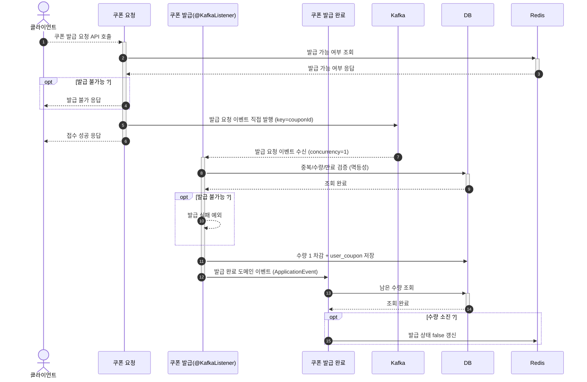

# 카프카 기반 쿠폰 발급 설계 보고서

기존 선착순 쿠폰 발급은 Redis의 **원자성 보장**과 **빠른 처리 속도**를 활용해 구현되어 있었다.
발급 요청을 Redis ZSET에 원자적으로 적재하고, **스케줄러가 매분 배치로** 후보를 꺼내 실제 발급을 수행하는 구조였다.

그러나 이 방식은 **즉시 발급이 아닌 배치 기반**이라, 사용자 관점에서 최대 1분의 **발급 지연**이 발생했다.
또한 다중 인스턴스 환경에서는 스케줄러가 중복 실행될 수 있어 **single-flight 보장**을 위한 추가 장치가 필요했다.

이를 해결하기 위해 **Kafka 기반 아키텍처**를 도입하여, 쿠폰 발급을 **순차 처리 + 즉시 발급**이 가능한 구조로 개선했다.

## Kafka 기반 전략

핵심 설계 요소는 **Topic 구조와 Partition 전략**이며, 다음 두 가지를 비교했다.

### 1) 파티션 키를 쿠폰 ID로 설정 (채택)

- **Topic**: `outside.coupon.publish.requested.v1`
- **Key**: 쿠폰 ID
- **Partition 수**: 1개

쿠폰 ID를 파티션 키로 사용하면 동일 쿠폰에 대한 요청이 **항상 동일 파티션으로 라우팅**되어, 컨슈머 1개(`concurrency = 1`)가 **선착순 순서를 보장**하며 순차 처리한다.

- 장점: 동일 쿠폰 요청 순서 보장, 구현 단순, 토픽 고정
- 단점: 파티션 1개라 병렬 처리 불가, 처리량 확장 한계

### 2) 토픽을 쿠폰 ID로 분리

- **Topic**: `outside.coupon.publish.requested.v1.{couponId}`
- **Key**: 없음 / **Partition 수**: 여러 개

쿠폰마다 별도 토픽을 생성해 순차성과 병렬성을 모두 확보할 수 있으나, **쿠폰마다 토픽 생성**이 필요해 운영 복잡도와 토픽 수가 과도하게 증가한다.

### 선택: 파티션 키 방식

복잡도를 고려해 **파티션 키를 쿠폰 ID로 두는 방식**을 채택했다. 대부분의 Kafka 기반 시스템에서 일반적으로 쓰이며, 일정 수준의 처리량과 순차 처리 보장을 동시에 만족하는 현실적인 전략이다.

### 토픽 버저닝 전략

Kafka의 **파티션 수는 생성 이후 변경 불가**하므로, 처리량 증가에 대비해 토픽명에 버전을 둔다.

> `outside.coupon.publish.requested.v1` → `outside.coupon.publish.requested.v2`

토픽을 버전 업하여 새 파티션 수를 적용하고, 프로듀서/컨슈머를 점진적으로 마이그레이션한다.

## Kafka 기반 설계

쿠폰 발급 요청 API는 Redis로 **발급 가능 여부만 조회**하고, 발급 요청 이벤트를 Kafka에 발행한다.
기존에는 Redis가 발급 로직 전반(요청 적재·배치 발급)을 담당했으나, 이제 **Redis는 "발급 가능 여부 플래그" 조회 용도로만 제한**하여 부담을 줄이고, 실제 처리는 Kafka 컨슈머가 분산 수행한다.

### 처리 흐름

**1) 발급 가능 여부 확인**
발급 요청 시 Redis에서 발급 가능 여부를 조회한다.

```
GET coupon:available:{couponId}
```

- 발급 가능: 발급 요청 이벤트를 Kafka에 발행하고 클라이언트에 성공(접수) 응답
- 발급 불가: 클라이언트에 발급 불가 응답

> 이 플래그는 쿠폰이 발급 가능 상태로 오픈될 때 `updateAvailableCoupon(couponId, true)`로 세팅된다.

**2) 발급 요청 이벤트 발행 (직접 발행)**
발급 요청은 **어떤 DB 트랜잭션에도 묶이지 않는 단순 접수**이므로, 아웃박스를 거치지 않고 `MessageProducer`로 **Kafka에 직접 발행**한다.
(트랜잭션 정합이 필요한 주문·결제 생명주기 이벤트만 아웃박스를 사용한다.)

**3) 발급 정보 조회 및 저장 (멱등성)**
발급 요청 이벤트를 수신한 컨슈머는 DB에서 중복 발급 여부·수량·만료일을 검증한다. `user_coupon`의 `(user_id, coupon_id)` **유니크 제약**과 중복 조회로 멱등성을 보장한다. 발급 가능하면 수량을 1 차감하고 `user_coupon`을 저장한다.

**4) 발급 완료 이벤트 발행 (도메인 이벤트)**
발급이 완료되면 인메모리 도메인 이벤트(`ApplicationEvent`)로 발급 완료 이벤트를 발행한다.

**5) 발급 상태 갱신**
발급 완료 이벤트를 수신해 남은 수량이 0이면 Redis 발급 상태를 내린다.

```
SET coupon:available:{couponId} false
```

### 시퀀스 다이어그램



## 구현

### 1) 발급 요청 서비스

발급 가능 여부를 확인하고 발급 요청 이벤트를 발행한다.

```java
public void requestPublishUserCoupon(CouponCommand.Publish command) {
    boolean publishable = couponRepository.findPublishableCouponById(command.getCouponId());

    if (!publishable) {
        throw new IllegalArgumentException("발급 불가한 쿠폰입니다.");
    }

    CouponEvent.PublishRequested event =
            CouponEvent.PublishRequested.of(command.getUserId(), command.getCouponId());
    couponEventPublisher.publishRequested(event);
}
```

### 2) 발급 요청 이벤트 직접 발행

발급 요청은 트랜잭션에 묶이지 않으므로 아웃박스를 거치지 않고 `MessageProducer`로 Kafka에 직접 발행한다.

```java
@Override
public void publishRequested(CouponEvent.PublishRequested event) {
    Message message = DefaultMessage.of(EventType.COUPON_PUBLISH_REQUESTED, event.getCouponId(), event);
    messageProducer.send(message);
}
```

`DefaultMessage`는 이벤트를 토픽·키·JSON payload로 감싸는 단순 메시지 구현체다.

```java
public static <T> DefaultMessage of(EventType type, Long key, T payload) {
    return new DefaultMessage(
            type.getTopic(),
            String.valueOf(key),
            Event.of(UUID.randomUUID().toString(), type, payload).toJson()
    );
}
```

### 3) 발급 요청 이벤트 수신 (`@KafkaListener`)

발행된 이벤트를 컨슈머가 수신해 발급을 진행하고, 완료 후 offset을 **수동 커밋**한다. `concurrency = 1`(파티션 키 = 쿠폰 ID)로 선착순 순서를 보장한다.

```java
@KafkaListener(topics = Topic.COUPON_PUBLISH_REQUESTED, groupId = GroupId.COUPON)
public void handle(String message, Acknowledgment ack) {
    Event<CouponEvent.PublishRequested> event = Event.of(message, CouponEvent.PublishRequested.class);
    CouponEvent.PublishRequested payload = event.getPayload();

    couponService.publishUserCoupon(CouponCommand.Publish.of(payload.getUserId(), payload.getCouponId()));
    ack.acknowledge();
}
```

### 4) 쿠폰 발급

중복 발급을 막고, 수량을 차감한 뒤 발급 완료 도메인 이벤트를 발행한다.

```java
@Transactional
public void publishUserCoupon(CouponCommand.Publish command) {
    couponRepository.findOptionalUserCouponByUserIdAndCouponId(command.getUserId(), command.getCouponId())
            .ifPresent(userCoupon -> {
                throw new IllegalArgumentException("이미 발급된 쿠폰입니다.");
            });

    Coupon coupon = couponRepository.findCouponById(command.getCouponId())
            .orElseThrow(() -> new IllegalArgumentException("쿠폰이 존재하지 않습니다."));
    coupon.publish();
    couponRepository.saveCoupon(coupon);

    UserCoupon userCoupon = UserCoupon.create(command.getUserId(), command.getCouponId());
    couponRepository.saveUserCoupon(userCoupon);

    couponEventPublisher.published(CouponEvent.Published.of(coupon));
}
```

### 5) 발급 완료 이벤트 수신 및 상태 갱신

발급 완료 도메인 이벤트를 커밋 이후(`AFTER_COMMIT`) 수신해 발급 상태를 갱신한다.

```java
@Async
@TransactionalEventListener(phase = TransactionPhase.AFTER_COMMIT)
public void handle(CouponEvent.Published event) {
    couponService.stopPublishCoupon(event.getId());
}
```

```java
@Transactional(readOnly = true)
public void stopPublishCoupon(Long couponId) {
    Coupon coupon = couponRepository.findCouponById(couponId)
            .orElseThrow(() -> new IllegalArgumentException("쿠폰이 존재하지 않습니다."));

    if (coupon.isNotPublishable()) {
        couponRepository.updateAvailableCoupon(couponId, false);
    }
}
```

## 테스트

Kafka 기반 발급은 요청→발급이 **비동기**이므로, E2E 테스트는 발급 가능 플래그를 세팅한 뒤 요청을 보내고, 발급 완료를 비동기로 검증한다(`Awaitility` 폴링).

```java
@DisplayName("쿠폰 발급을 요청하면 접수된다.")
@Test
void issueCoupon() {
    Coupon coupon = couponRepository.saveCoupon(
            Coupon.create("쿠폰명1", 0.1, 10, CouponStatus.PUBLISHABLE, LocalDateTime.now().plusDays(1)));
    couponRepository.updateAvailableCoupon(coupon.getId(), true); // 발급 가능 플래그 세팅

    client.post()
            .uri("/api/v1/users/{userId}/coupons/issue", user.getId())
            .contentType(MediaType.APPLICATION_JSON)
            .body(Map.of("couponId", coupon.getId()))
            .exchange()
            .expectStatus().isOk()
            .expectBody()
            .jsonPath("$.code").isEqualTo(200)
            .jsonPath("$.message").isEqualTo("OK");
}
```

> 발급 요청 접수(응답 200)까지 검증한다. Kafka 컨슈머의 실제 발급 완료(`user_coupon` 저장, 수량 소진 시 Redis 플래그 `false`)까지 검증하려면 `Awaitility`로 30초/500ms 폴링을 추가한다.

## Redis 배치 기반 vs Kafka 기반

| 항목 | Redis 배치 기반 | Kafka 기반 |
|---|---|---|
| 처리 방식 | ZSET 적재 + 매분 배치 | 이벤트 기반 즉시 처리 |
| 발급 지연 | 평균 1분 (배치 의존) | 실시간 발급 |
| DB 부하 | 배치 Bulk Insert | 단건 처리로 분산 |
| Redis 사용량 | 요청 정보 전체 적재 | 발급 가능 여부 조회만 |
| 다중 인스턴스 | 스케줄러 single-flight 필요 | 컨슈머 그룹이 1회만 소비 |
| 운영 편의성 | 배치 관리 필요 | 배치 제거로 단순화 |

## 결론

Kafka 기반 아키텍처 도입으로 다음을 달성했다.

- **즉시 발급** 가능한 사용자 친화적 쿠폰 시스템
- **배치 제거**를 통한 운영 간소화 및 장애 지점 감소
- **Redis 부하 감소**(발급 가능 여부 조회로 제한)
- **파티션 키(쿠폰 ID) + concurrency=1**로 선착순 순차 처리 보장
- **유니크 제약 + 중복 검증**으로 멱등성 확보

결과적으로 선착순 쿠폰 발급의 핵심 요건인 **동시성 제어와 즉시성**을 동시에 만족하는 구조를 구축했다.
