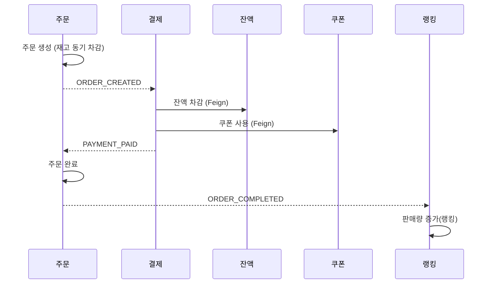
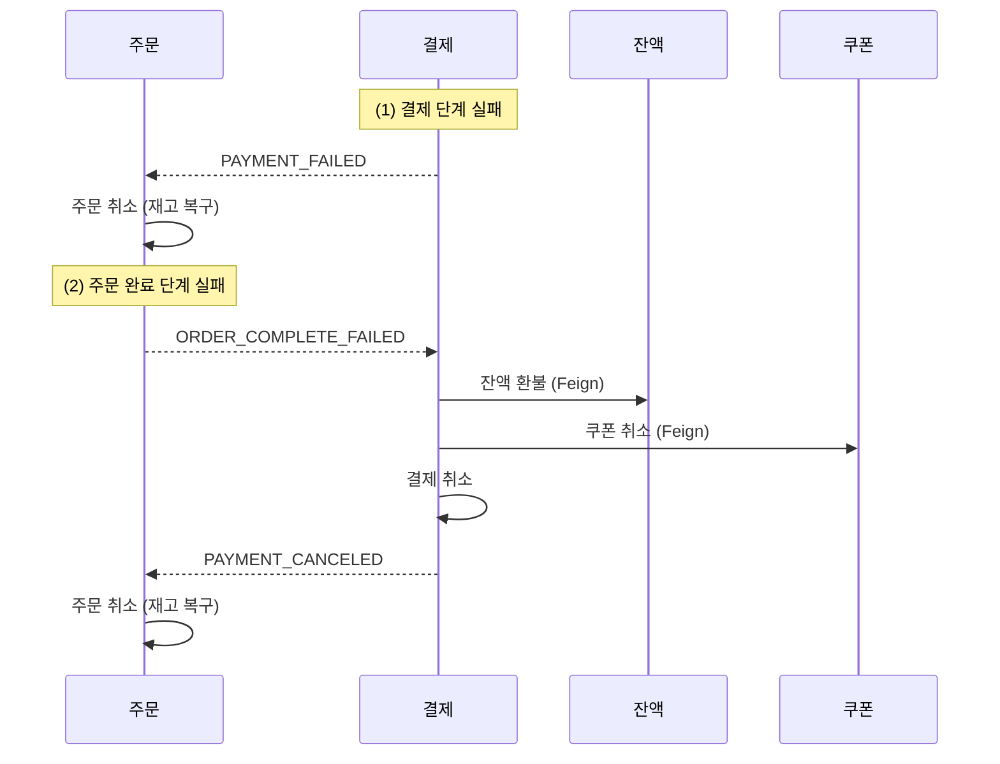

# MSA 모듈 분리 및 주문/결제 보상 트랜잭션 보고서

> 이벤트 기반 설계 의도와 도메인 분리 기준은 [05. 이벤트 기반 아키텍처 설계 보고서](05.MsaEventDrivenArchitectureReport.md)에서 다룬다. 05가 모놀리식 단계의 설계(인프로세스 상태 집계·분산락·병렬 이벤트)를 서술한다면, 본 문서는 실제 물리적 서비스 분리(멀티모듈) 이후의 구현과 그 과정에서 설계가 단순화된 지점을 다룬다.

## 배경

서비스 규모가 커지면 모놀리식 아키텍처는 배포·확장·장애 격리 측면에서 한계를 드러낸다. 하나의 배포 단위에 모든 도메인이 묶여 있어, 특정 도메인의 변경이 전체 배포를 유발하고 한 지점의 장애가 시스템 전체로 전파된다.

이를 해결하기 위해 도메인 단위로 서비스를 분리했지만 MSA는 만능이 아니다. 서비스가 분리되면 하나의 트랜잭션으로 묶여 있던 작업이 여러 서비스의 로컬 트랜잭션으로 쪼개지면서 데이터 정합성 문제가 발생한다.  그 정합성을 어떻게 보장했는지 주문/결제 흐름의 이벤트 설계와 보상 트랜잭션을 다룬다.

---

## 도메인 분리 및 배포 단위

Bounded Context와 애그리거트 경계를 기준으로 도메인을 식별하고, 각 도메인을 독립 배포 로 분리했다.

### AS-IS — 모놀리식

하나의 애플리케이션 안에 전 도메인이 존재:
사용자(User), 잔액(Balance), 쿠폰(Coupon/UserCoupon), 상품(Product/Stock), 랭킹(Rank), 주문(Order/OrderProduct), 결제(Payment)

### TO-BE — MSA

| 서비스 | 담당 도메인 | 포트 |
|---|---|---|
| user-service | 사용자 | 8081 |
| balance-service | 잔액 | 8082 |
| coupon-service | 쿠폰, 사용자쿠폰 | 8083 |
| product-service | 상품, 재고, 랭킹 | 8084 |
| order-service | 주문, 주문상품 | 8085 |
| payment-service | 결제 | 8086 |

공통 관심사는 별도 모듈로 분리했다: `common:client`(Feign 계약), `common:message`(Kafka 프로듀서/이벤트), `common:outbox`(트랜잭셔널 메시징).

---

## 이벤트 기반 아키텍처

서비스 간 통신은 두 방식을 혼합한다.

- 동기 (Feign / REST) — 즉시 응답과 강한 일관성이 필요한 조회·검증. 예: 주문 생성 시 사용자 검증·상품 조회, 결제 시 잔액 차감.
- 비동기 (Kafka 이벤트) — 서비스 간 결합도를 낮추고 장애를 격리해야 하는 흐름. 예: 주문 생성 → 결제 시작, 결제 완료 → 주문 완료.

### Outbox 패턴

이벤트 발행과 로컬 트랜잭션의 원자성을 보장하기 위해 Outbox 패턴을 적용했다. 도메인 로직과 같은 트랜잭션 안에서 아웃박스 레코드를 저장(`@TransactionalEventListener(BEFORE_COMMIT)`)하고, 커밋 후 별도로 Kafka에 발행한다. 발행 실패 시 스케줄러가 미발행 레코드를 재전송해 at-least-once를 보장한다.

### 이벤트 정의 (토픽)

`ORDER_CREATED`, `ORDER_COMPLETED`, `ORDER_COMPLETE_FAILED`, `PAYMENT_PAID`, `PAYMENT_FAILED`, `PAYMENT_CANCELED`

각 서비스는 자신이 소비하는 이벤트의 로컬 계약 복사본만 갖는다(소비자 측 DTO). 프로듀서와 컨슈머가 서로의 클래스를 공유하지 않아 결합도가 낮고, Jackson은 모르는 필드를 무시한다.

---

### 성공 케이스



1. 주문 서비스는 주문을 생성하며 상품 재고를 동기(Feign)로 차감하고, 커밋 후 `ORDER_CREATED`를 발행한다.
2. 결제 서비스는 이를 수신해 잔액 차감·쿠폰 사용을 동기(Feign)로 오케스트레이션하고, 성공 시 `PAYMENT_PAID`를 발행한다.
3. 주문 서비스는 주문을 완료하고 `ORDER_COMPLETED`를 발행하며, 랭킹 서비스가 이를 받아 판매량을 집계한다.

> 설계 선택: 잔액·쿠폰 차감을 결제 서비스가 동기로 묶어 처리한다. 각 도메인이 이벤트로 병렬 처리하는 choreography 설계도 가능하지만, 분산 상태 집계와 조율 비용이 크다. 배포 단위가 갓 분리된 현 단계에서는 결제가 오케스트레이터 역할을 하는 단순 선형 사가가 추적,디버깅이 쉽고 정합성 관리가 명확하다고 판단했다.

---

### 보상 트랜잭션 (실패 케이스)

서비스별 로컬 트랜잭션으로 쪼개진 만큼, 실패 시 이미 수행된 작업을 되돌리는 보상이 필요하다. 두 실패 지점을 다룬다.



(1) 결제 실패 → 결제 서비스가 `PAYMENT_FAILED`를 발행하고, 주문 서비스가 이를 받아 주문을 취소하며 재고를 복구한다.

(2) 주문 완료 실패 (결제는 성공했으나 이후 완료 단계에서 실패) → 이미 성공한 결제를 되돌려야 한다. 주문 서비스가 `ORDER_COMPLETE_FAILED`를 발행하면, 결제 서비스가 이를 받아 잔액 환불 + 쿠폰 취소를 수행하고 결제를 취소한 뒤 `PAYMENT_CANCELED`를 발행한다. 주문 서비스는 이를 받아 재고를 복구한다.

결제 취소 시 결제 엔티티에는 사용자 정보가 없으므로, 주문 서비스를 Feign으로 조회(`getOrder`)해 userId·userCouponId를 확보한 뒤 보상을 실행한다.

```java
@Transactional
public void cancelPayment(Long orderId) {
    Payment payment = paymentRepository.findByOrderId(orderId)
            .orElseThrow(() -> new IllegalArgumentException("결제가 존재하지 않습니다."));

    PaymentInfo.Order order = paymentClient.getOrder(orderId);   // 주문 조회로 보상 대상 확보

    paymentClient.refundBalance(order.getUserId(), payment.getAmount());  // 잔액 환불
    if (order.getUserCouponId() != null) {
        paymentClient.cancelCoupon(order.getUserCouponId());             // 쿠폰 취소
    }
    payment.cancel();
    paymentRepository.save(payment);
    paymentEventPublisher.canceled(PaymentEvent.Canceled.of(orderId));   // → 주문 재고 복구
}
```

---

## 한계 및 개선 과제

현재 구현은 "정상 흐름 + 두 실패 경로의 보상"까지를 다룬다. 다음은 실무 수준으로 가기 위한 남은 과제이며, 문서와 코드의 일치를 위해 아직 구현하지 않은 것을 기록한다.

- 멱등성 미구현 — 동일 이벤트가 중복 소비되면(Kafka at-least-once) 중복 결제·중복 재고 복구가 발생할 수 있다. `Payment.orderId` 유니크 제약과 컨슈머 측 멱등 처리, 주문 상태 가드가 필요하다.
- 결제 부분 실패 보상 공백 — 결제 단계에서 잔액을 차감한 뒤 쿠폰 사용이 실패하면, `PAYMENT_FAILED` 경로는 재고만 복구하고 이미 차감된 잔액은 환불하지 않는다. 결제 내부에서 성공한 원격 작업을 즉시 보상하도록 개선해야 한다.
- 실패 이벤트 유실 가능성 — 실패 이벤트를 실패하는 트랜잭션 안에서 발행하고 예외를 던지면, 아웃박스 저장이 롤백되어 이벤트가 유실될 수 있다. 실패는 "예외 전파"가 아니라 "실패 상태 커밋 + 이벤트 발행"으로 다뤄야 안전하다.
- DLT(Dead Letter Topic) 미구성 — 재시도 소진 메시지를 격리·분석하는 경로가 없다.
- 쿠폰 보상의 제약 — 쿠폰 복구는 취소 API에 의존한다. 보상 API가 없는 자원은 되돌릴 수 없으므로, 보상 가능성을 전제로 작업 순서를 설계해야 한다.

---

## 결론

도메인 단위 서비스 분리와 이벤트 기반 통신으로 결합도를 낮추고 배포,장애를 격리했다. 분산 트랜잭션의 정합성은 동기(Feign) 오케스트레이션 + 비동기(Kafka) 이벤트 + 보상 트랜잭션의 조합으로 관리했으며분산 상태 집계 대신 추적 가능한 단순 선형 사가를 택해 현 단계의 복잡도를 통제했다.

다만 이벤트 기반 MSA는 시스템 복잡도를 크게 높인다. 멱등성·부분 실패 보상·실패 이벤트 보존은 정합성의 핵심이며, 위 한계 과제를 해소해야 운영 수준의 신뢰성에 도달한다. 아키텍처 도입 여부와 정교함의 수준은 서비스 규모와 운영 환경을 고려해 단계적으로 결정하는 것이 바람직하다.
